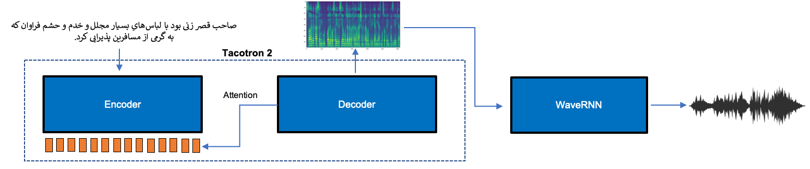
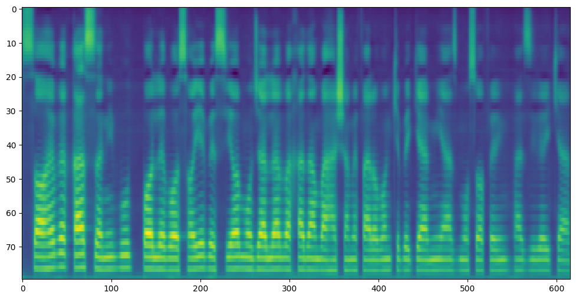
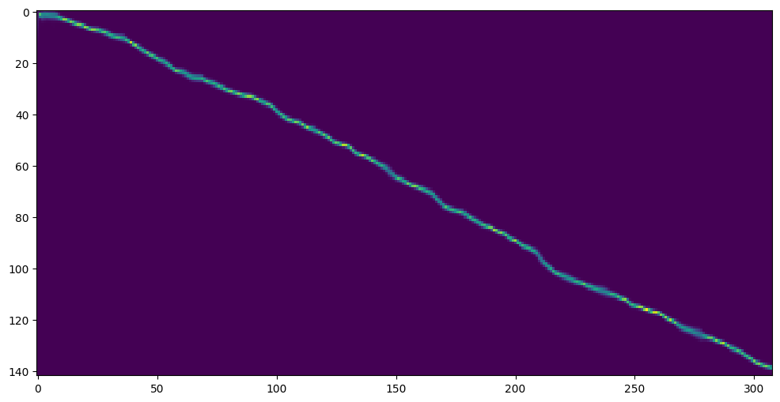

# Tacotron 2 - Persian
<p align="center">
</p>


<strong>Visit <a href="https://hamedhemati.github.io/Tacotron-2-Persian-Demo/">this demo page</a> to listen to some audio samples</strong>

This repository contains implementation of a Persian Tacotron model in `PyTorch` with a dataset preprocessor for Common Voice. For generating better quality audios, the acoustic features (mel-spectrogram) are fed to a WaveRNN model, therefore I've included a WaveRNN vocoder only for infernece (no trainer included).

The source code in this repository is highly inspired by and partially copied (and modified) from the following repostories:<br>

Tacotron model: https://github.com/espnet/espnet <br>
WaveRNN and some utils: https://github.com/mozilla/TTS <br>

### Model specs:<br>
***Encoder*** : CNN layers with batch-norm and a bi-directional lstm on top.<br>
***Decoder***: 2 LSTMs for the recurrent part and a post-net on top.<br>
***Attention type***: GMM v2 with k=25.

## Datasets
The model is trained on audio files from one of the speakers in `Common Voice Persian` which can be downloaded from the link below:
https://commonvoice.mozilla.org/en/datasets

Unfortunately, only a few number of speakers in the dataset have enough number of utterances for training a Tacotron model and most of the audio files have low quality and are noisy. I found audio files from one of the speakers more approriate for training whose speaker id is hard-coded in the `commonvoice_fa` preprocessor.

### Data preprocessing
After downloading the dataset, first set `DATASET_PATH` and `DATASET_PATH` variables in the file `scripts/preprocess/preprocess_commonvoice_fa.sh` and then run:
```
sh scripts/preprocess/preprocess_commonvoice_fa.sh
```
This will features required for training the model and will create a meta file that contains transcripts and phonemization of each transcript in individual lines along with other meta info.<br>
Finally, you need to create two files named `metadata_train.txt` and `metadata_eval.txt` out of `metadata.txt`. First get number of lines in the transcript file with `wc -l metadata.txt`, then if for example there is 10000 lines in the metadata file you can split it with as below:<br>
```
shuf metadata.txt >> medata_shuf.txt
head -n 9000 metadata_shuf.txt > metadata_train.txt
tail -n 1000 metadata_shuf.txt > metadata_eval.txt
```

## Experiments
Each experiment consists of three files namely `train.sh`, `generate.sh` and `config.yml`.

### Training
All training parameters and model hyperparameters are saved in a YAML config file under the folder created for each experiment. To train the model for Common Voice Persian you can first change the parameters in `scripts/tacotron2persian_commonvoice_fa/config.yml` and then simply run:
```
sh scripts/tacotron2persian_commonvoice_fa/train.sh
```

### Inference
Once the model training is finished, you can generated audio after setting the variables in `generate.sh` as below:

```
sh scripts/tacotron2persian_commonvoice_fa/generate.sh
```

## Demo
To only test the model, I've provided a demo script folder that also contains the checkpoints for Tacotron and WaveRNN. Download the demo experiment zip from:<br>
https://drive.google.com/file/d/1wzlBGgROS76W4xOY1UpCZaW5zropyLVL/view?usp=sharing
<br>
and unzip it under `./scripts/` folder. Similar to what explained in the `Inference` section, you just need to run:
```
sh scripts/demo/generate.sh
```

### Example outputs
Below you see the generated mel-spectrogram and attention matrix for the setence:<br>

<div dir="rtl">
صاحب قصر زنی بود با لباس‌هایِ بسیار مجلل و خدم و حشم فراوان که به گرمی از مسافرین پذیرایی کرد.
</div>
<br>

<p align="left">
</p>

<p align="left">
</p>

***Obviously, the quality of generated mel-spectrogram/audio is lower than those generated from a standard model trained on English or Japanese languages, which is mainly caused by the quality of the audios in the dataset.***


## WaveRNN
The WaveRNN checkpoint used for generating the sample audios is trained on LibriTTS with 22K sampling rate. It can reconstruct waveforms for any female/male voice with an acceptable quality. Give it a try on your own voice ;)
